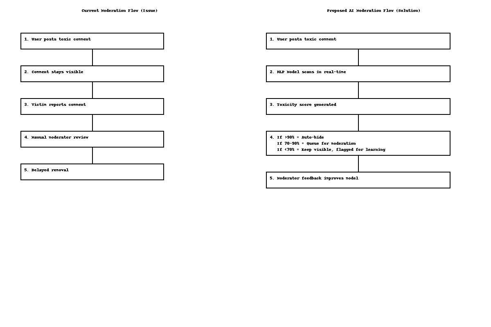

# 🛡️ Toxic Content Moderation with AI  
**Case Study: Reducing Harassment & Abuse in Social Platforms using NLP**

---

## 🔍 Problem Statement
Harassment and abusive comments are a critical problem on social media platforms like YouTube, Twitter (X), and Reddit.  
Current moderation is **manual, reactive, and inconsistent**, leading to:  
- Negative user experience 😡  
- Creator churn 😔  
- Low brand trust 🛑  

**Goal:** Build an AI-assisted moderation system to auto-detect and flag toxic comments, reducing abuse visibility by 70%.  

---

## 👤 User Personas  

1. **Neha, 24, YouTuber**  
   - Faces abusive comments daily.  
   - Wants a safer environment for herself & her audience.  

2. **Raj, 29, Community Moderator**  
   - Manages 10k+ forum members.  
   - Needs automated help to filter toxic content without false positives.  

---

## 🗺️ Current Flow (Issue)  
1. User posts abusive comment.  
2. Comment stays visible until reported.  
3. Manual review → Delayed removal.  
4. Victims suffer harm → Negative brand trust.  

---

## 💡 Proposed Solution: AI Toxicity Filter  

- **NLP Model (BERT / Perspective API / HuggingFace)** detects toxicity levels:  
  - Hate Speech  
  - Harassment  
  - Profanity  
  - Threats  

- **Real-time flagging**: Hide comment + notify moderator.  
- **Confidence Thresholds**:  
  - >90% → Auto-hide immediately.  
  - 70–90% → Send to moderation queue.  
  - <70% → Visible, but flagged for learning.  

### Features  
✅ Multi-language support (English + Hindi/vernacular).  
✅ Dashboard for moderators to approve/reject flagged items.  
✅ Continuous learning (model improves from moderator feedback).  

📌 *Wireframes available in `/images` folder*  

---

## 📊 Success Metrics (KPIs)  

- 📉 **Toxic Content Visibility** ↓ 70%  
- ⏱️ **Moderation Time per Comment** ↓ 60%  
- 😊 **Creator Satisfaction (NPS)** ↑ +15 points  
- 📈 **Community Engagement** ↑ 20% (less toxicity = more participation)  

---

## 🚀 Roadmap  

**Phase 1 (MVP – 2 months)**  
- Integrate existing NLP model (Google Perspective API).  
- Flag toxic content + auto-hide at >90% confidence.  

**Phase 2 (Optimization – 4–6 months)**  
- Multi-language detection.  
- Moderator dashboard for review + feedback loop.  

**Phase 3 (Future Vision – 9–12 months)**  
- AI model fine-tuned on platform-specific data.  
- Explainable AI → Show *“Why this was flagged.”*  
- Sentiment + sarcasm detection.  

---

## 🎨 Wireframe  

**Toxic Comment Moderation Flow**  

  

---

## 🧠 Key Learnings  
- AI + Human-in-the-loop moderation provides balance between safety & fairness.  
- Confidence thresholds reduce false positives while protecting users.  
- Toxicity reduction → measurable impact on engagement & trust.  

---

## 📌 Project Tags  
`#ProductManagement` `#AI` `#NLP` `#CaseStudy` `#ContentModeration` `#SocialMedia`  
